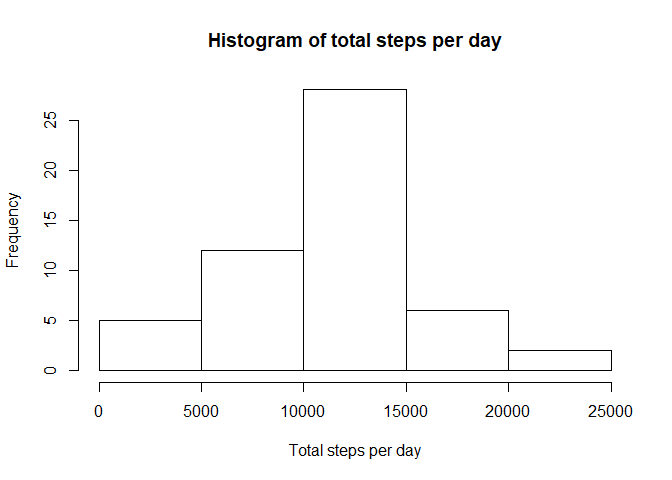
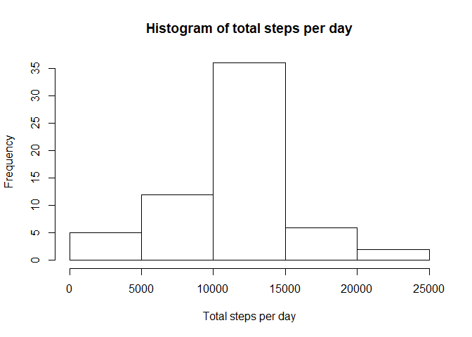
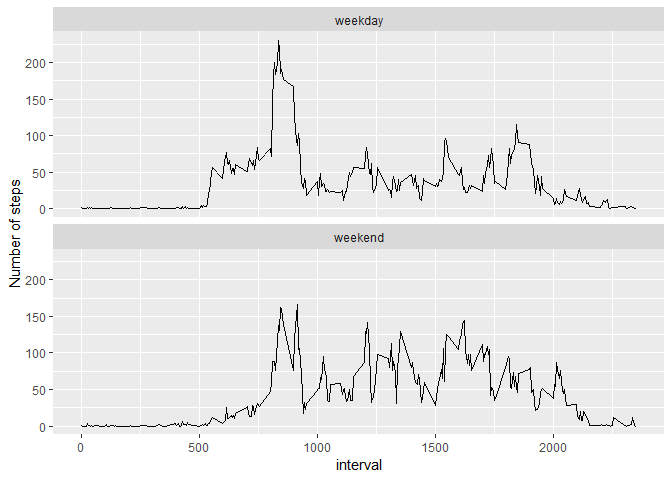

## Loading and preprocessing the data
1. Code for reading in the dataset and/or processing the data

```r
library(readr)
activity <- read_csv("activity.zip")
```
## What is mean total number of steps taken per day?
The total number of steps taken per day:

```r
library(tidyverse)
(total_steps <- activity %>%
  group_by(date) %>%
  summarise(total_steps = sum(steps)))
```

```
## # A tibble: 61 x 2
##    date       total_steps
##    <date>           <int>
##  1 2012-10-01          NA
##  2 2012-10-02         126
##  3 2012-10-03       11352
##  4 2012-10-04       12116
##  5 2012-10-05       13294
##  6 2012-10-06       15420
##  7 2012-10-07       11015
##  8 2012-10-08          NA
##  9 2012-10-09       12811
## 10 2012-10-10        9900
## # ... with 51 more rows
```
2. Histogram of the total number of steps taken each day

```r
with(total_steps, hist(total_steps, main = "Histogram of total steps per day", xlab = "Total steps per day"))
```

<!-- -->

```r
mean_steps <- mean(total_steps$total_steps, na.rm = T)
median_steps <- median(total_steps$total_steps, na.rm = T)
```
3. Mean and median number of steps taken each day  
The mean of the total number of steps taken per day is 10766 steps.  
The median of the total number of steps taken per day is 10765 steps.  

## What is the average daily activity pattern?
4. Time series plot of the average number of steps taken

```r
avg_steps <- activity %>%
  group_by(interval) %>%
  summarise(avg_steps = mean(steps, na.rm = T))

avg_steps %>%
  ggplot(aes(interval, avg_steps)) +
    geom_line()
```

<!-- -->

5. The 5-minute interval that, on average, contains the maximum number of steps

```r
interval_with_highest_steps <- avg_steps %>%
  arrange(desc(avg_steps)) %>% .$interval %>% .[1]
```
The 835th 5-minute interval, on average across all the days in the dataset, contains the maximum number of steps.  

## Imputing missing values

```r
# verify that NAs only occur in "steps" column
all(!is.na(activity[,2:3]))
```

```
## [1] TRUE
```

```r
# calculate the number of NAs
total_NA <- sum(is.na(activity$steps))
```
There are total 2304 missing values in the dataset (i.e. the total number of rows with NA).
  
6. Code to describe and show a strategy for imputing missing data: impute the NAs with the mean for that 5-minute interval

```r
activity_NA_imputed <- activity
activity_NA_imputed[is.na(activity_NA_imputed$steps),] <- activity_NA_imputed %>%
  filter(is.na(steps)) %>%
  left_join(avg_steps, by = "interval") %>%
  mutate(steps = round(avg_steps)) %>% select(1:3)
activity_NA_imputed
```

```
## # A tibble: 17,568 x 3
##    steps date       interval
##    <dbl> <date>        <int>
##  1     2 2012-10-01        0
##  2     0 2012-10-01        5
##  3     0 2012-10-01       10
##  4     0 2012-10-01       15
##  5     0 2012-10-01       20
##  6     2 2012-10-01       25
##  7     1 2012-10-01       30
##  8     1 2012-10-01       35
##  9     0 2012-10-01       40
## 10     1 2012-10-01       45
## # ... with 17,558 more rows
```
7. Histogram of the total number of steps taken each day after missing values are imputed

```r
total_steps_NA_imputed <- activity_NA_imputed %>%
  group_by(date) %>%
  summarise(total_steps = sum(steps))

with(total_steps_NA_imputed, hist(total_steps, main = "Histogram of total steps per day", xlab = "Total steps per day"))
```

<!-- -->


```r
mean_steps_NA_imputed <- mean(total_steps_NA_imputed$total_steps, na.rm = T)
median_steps_NA_imputed <- median(total_steps_NA_imputed$total_steps, na.rm = T)
```
The mean of the total number of steps taken per day with NA-imputed data is 10765 steps.  
The median of the total number of steps taken per day with NA-imputed data is 10762 steps.  
Both mean and median total number of steps taken per day are slightly smaller than previously calculated.  

## Are there differences in activity patterns between weekdays and weekends?
8. Panel plot comparing the average number of steps taken per 5-minute interval across weekdays and weekends

```r
library(lubridate)

activity_NA_imputed %>% 
  mutate(weekday = as.factor(ifelse(wday(date, locale = "us")%in%2:6, "weekday","weekend"))) %>%
  group_by(weekday, interval) %>%
  summarise(avg_steps = mean(steps)) %>%
  ggplot(aes(interval, avg_steps)) +
  geom_line() + facet_wrap(~weekday, nrow = 2) +
  labs(y = "Number of steps")
```

<!-- -->

